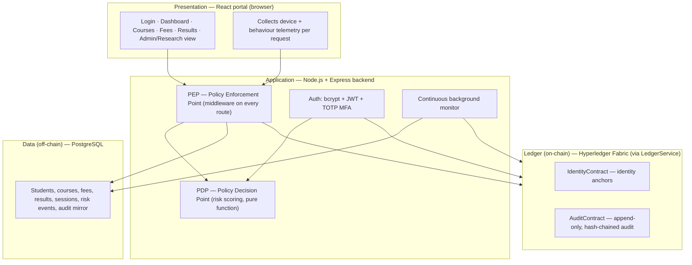
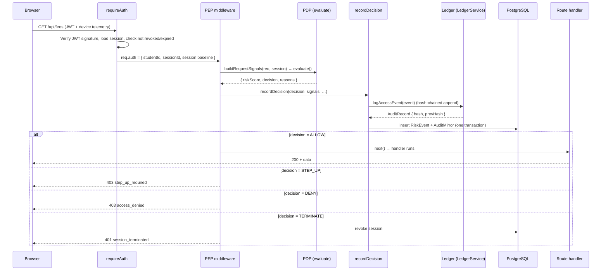
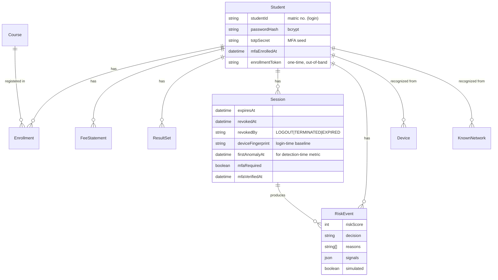
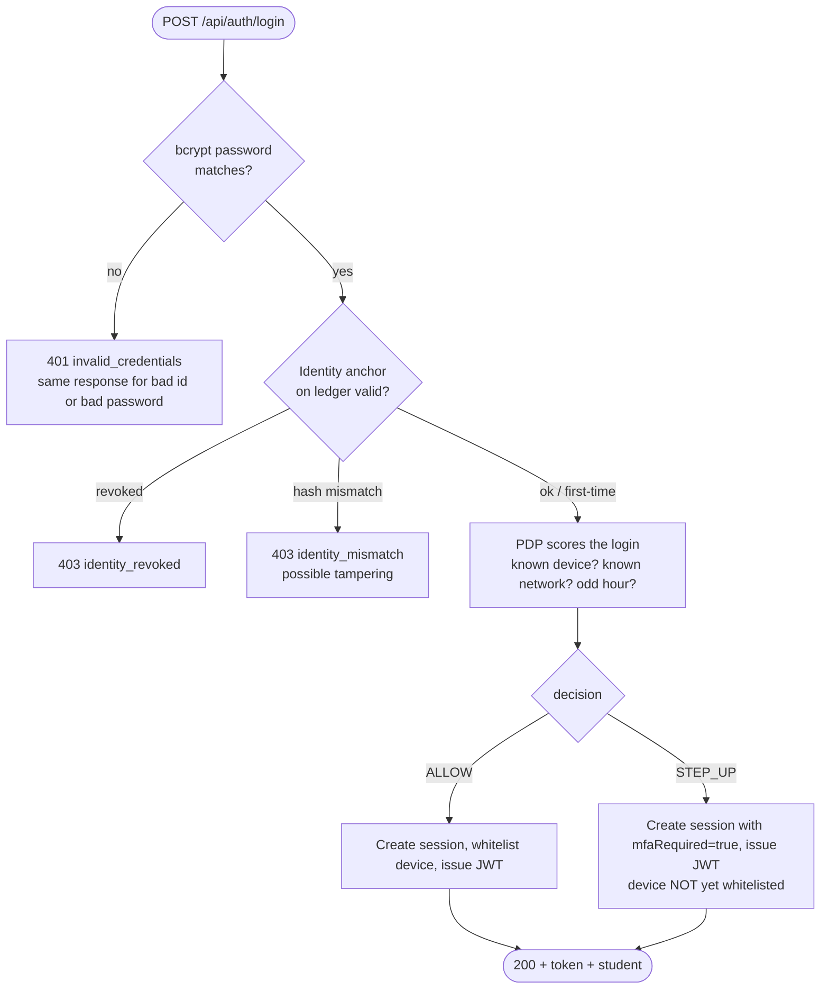
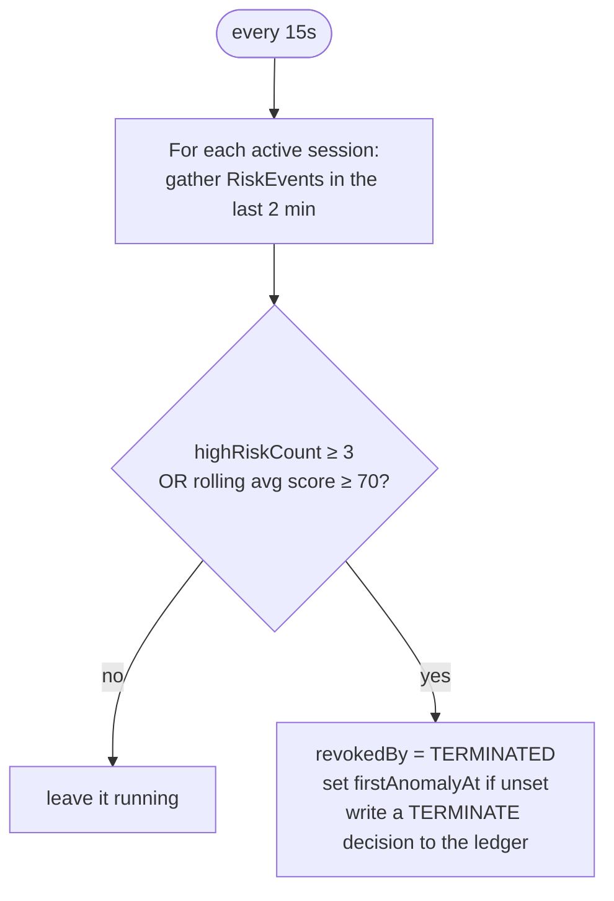
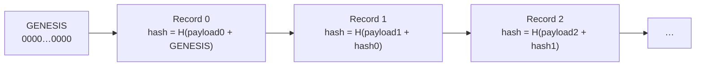
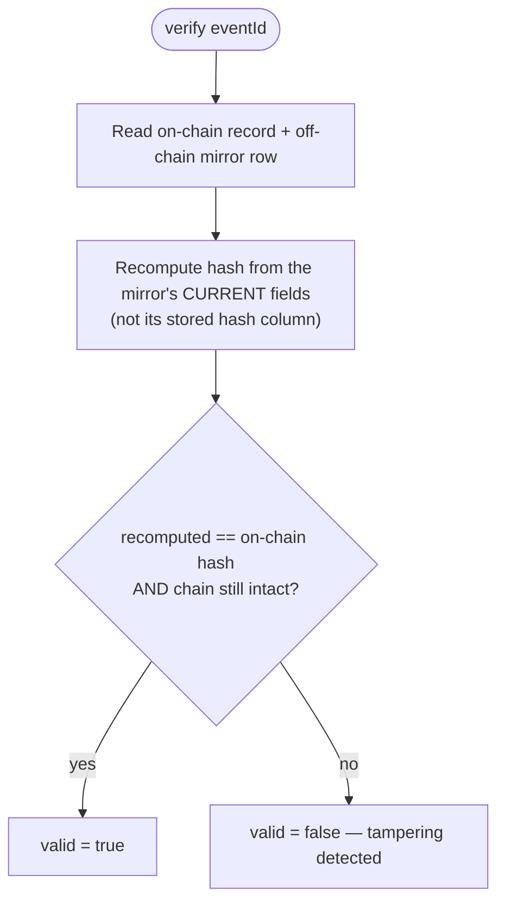
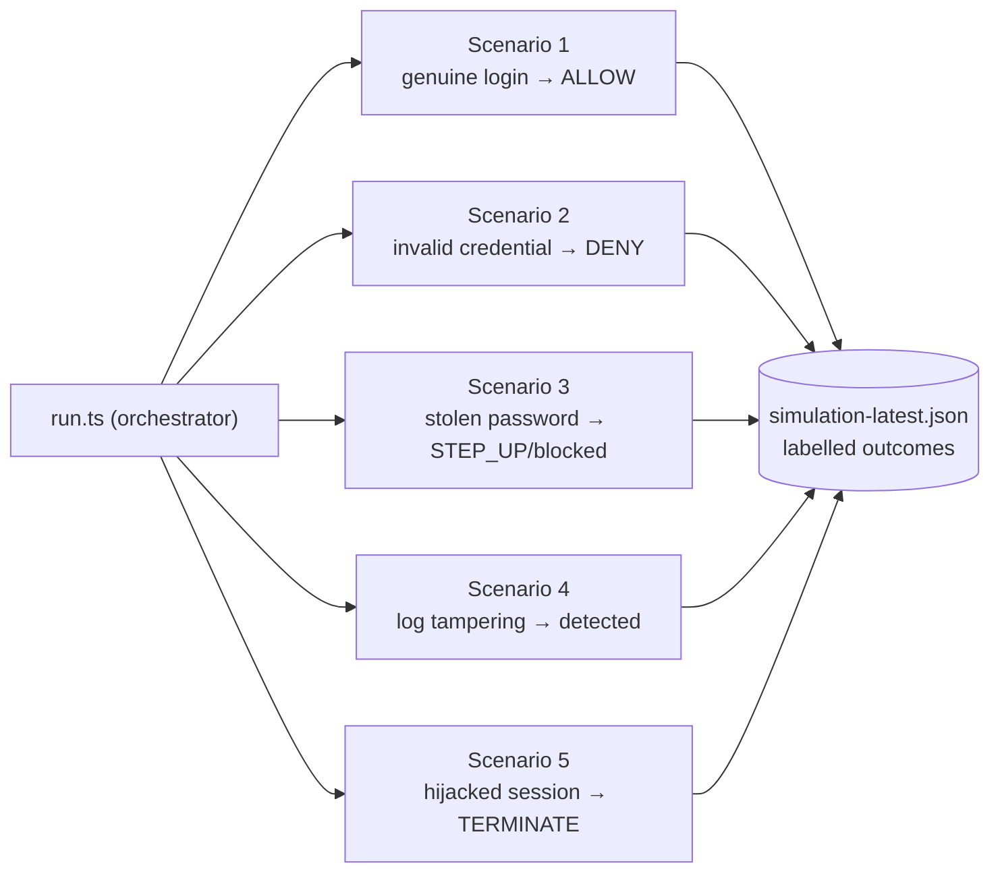

# Technical Report — Blockchain-Enhanced Identity Verification for Zero Trust Access Control

> A complete walkthrough of the system: what every part does, how the code is organized, and how
> a request flows end-to-end. Written to be read top-to-bottom — it starts high-level and drills
> into the code, with links to every source file.
>
> Diagrams use [Mermaid](https://mermaid.js.org/); they render on GitHub, in the VS Code Mermaid
> extension, and in Claude Artifacts. If you see raw ```mermaid blocks, install a Mermaid viewer.

**Contents**

1. [What the system is](#1-what-the-system-is)
2. [Architecture at a glance](#2-architecture-at-a-glance)
3. [Technology stack & repository layout](#3-technology-stack--repository-layout)
4. [The core idea: the Zero Trust request lifecycle](#4-the-core-idea-the-zero-trust-request-lifecycle)
5. [Data model (PostgreSQL)](#5-data-model-postgresql)
6. [Backend deep-dive](#6-backend-deep-dive)
   - 6.1 [Login & identity anchoring](#61-login--identity-anchoring)
   - 6.2 [The PDP — risk scoring](#62-the-pdp--risk-scoring)
   - 6.3 [The PEP — enforcement middleware](#63-the-pep--enforcement-middleware)
   - 6.4 [Step-up MFA (TOTP)](#64-step-up-mfa-totp)
   - 6.5 [The continuous background monitor](#65-the-continuous-background-monitor)
   - 6.6 [The ledger abstraction & hash chaining](#66-the-ledger-abstraction--hash-chaining)
   - 6.7 [The write path: recordDecision](#67-the-write-path-recorddecision)
   - 6.8 [Tamper detection](#68-tamper-detection)
7. [The chaincode (Phase 5)](#7-the-chaincode-phase-5)
8. [The attack simulation (Phase 8)](#8-the-attack-simulation-phase-8)
9. [The metrics & CES engine (Phase 9)](#9-the-metrics--ces-engine-phase-9)
10. [The frontend](#10-the-frontend)
11. [End-to-end traces](#11-end-to-end-traces)
12. [How to run everything](#12-how-to-run-everything)
13. [Current status & what remains](#13-current-status--what-remains)

---

## 1. What the system is

A **university student portal** (login, course registration, fee statements, exam results) secured
by two ideas working together:

- **Zero Trust** — *never trust, always verify*. Every single request is re-evaluated for risk;
  a valid login token is never, by itself, enough. If a request looks risky mid-session, access is
  stepped-up, denied, or the session is killed outright.
- **Blockchain-anchored identity + audit** — each student's identity is *anchored* on a permissioned
  Hyperledger Fabric ledger, and every access decision is written to an **append-only, hash-chained**
  audit trail. Because the ledger cannot be rewritten, tampering with the records is always detectable.

The three security problems it targets (from the brief): **credential compromise** (stolen
passwords), **data adulteration** (tampering with stored records), and **lateral movement**
(a hijacked session roaming the system).

> **Important current caveat.** The real Fabric network is not running yet. The system runs behind
> a **`LedgerService` interface** with a `MockLedger` implementation (backed by PostgreSQL tables
> that *imitate* the ledger's guarantees). The real chaincode is written and tested but not deployed.
> See [§13](#13-current-status--what-remains). Everywhere below, "the ledger" means "whatever
> implements `LedgerService`" — today that's `MockLedger`; tomorrow it's `FabricLedger`.

---

## 2. Architecture at a glance

Four layers, each with one job:



**The reading of it:** the browser sends a request (with device telemetry) → the PEP intercepts it →
asks the PDP for a risk decision → enforces that decision → writes the decision to the ledger and
mirrors it to PostgreSQL → returns the response. A background monitor independently re-scores live
sessions and can terminate one with no new request.

---

## 3. Technology stack & repository layout

| Layer | Technology |
|---|---|
| Blockchain | Hyperledger Fabric 2.5 (test-network) — *target; not yet running* |
| Smart contracts | Node.js chaincode (`fabric-contract-api`) |
| Backend | Node.js + Express + TypeScript |
| Database | PostgreSQL 16 (Prisma ORM) |
| Frontend | React + Vite + TypeScript + Tailwind |
| Auth | JWT + TOTP MFA (bcrypt password hashing) |

```
backend/
├── src/
│   ├── app.ts                    Express assembly: middleware, health, route mounting
│   ├── index.ts                  Server entry point (starts the continuous monitor)
│   ├── auth/                     Login, logout, MFA, JWT, requireAuth guard
│   ├── zerotrust/                The Zero Trust engine: PDP, PEP, signals, monitor, identity
│   ├── portal/                   Portal API: courses, enrollment, fees, results
│   ├── audit/                    Admin/research routes: audit trail, verify, live metrics
│   ├── ledger/                   LedgerService interface + MockLedger + FabricLedger + hashEvent
│   ├── config/                   env + policy.config (weights, thresholds — the tuning knobs)
│   └── db/                       Prisma client
├── prisma/                       schema.prisma, migrations, seed.ts (30 students)
├── chaincode/                    Fabric smart contracts (Phase 5) — own package.json
├── simulation/                   The 5 attack scenarios (Phase 8)
├── evaluation/                   Metrics + CES engine (Phase 9)
└── tests/e2e.ts                  End-to-end HTTP test of the whole engine
frontend/
└── src/                          React portal (pages, components, context, api client)
```

> `chaincode/`, `simulation/`, and `evaluation/` live under `backend/` at the client's request
> (the roadmap originally placed them at the repo root). `chaincode/` is **not** backend code — it
> runs on the Fabric peers and keeps its own `package.json`.

---

## 4. The core idea: the Zero Trust request lifecycle

This is the single most important flow in the system. **Every authenticated request** to a
protected route goes through it.



The two halves — the **PDP** (decides) and the **PEP** (enforces) — are deliberately separated
(NIST SP 800-207 style). The PDP is a **pure function**: signals in, decision out, no side effects.
The PEP is where the I/O and enforcement live. This separation is what makes the risk logic testable
and the weights tunable in one config file.

---

## 5. Data model (PostgreSQL)

Defined in [prisma/schema.prisma](backend/prisma/schema.prisma). The tables fall into four groups.



**Group 1 — application data:** `Student`, `Course`, `Enrollment`, `FeeStatement`/`FeeItem`/`Payment`,
`ResultSet`/`ResultRecord`. Ordinary portal data.

**Group 2 — Zero Trust state:**
- `Session` — one login session. The JWT carries this row's id as its `jti`, so revoking the row kills
  the token instantly. Records the login-time device/IP/fingerprint *baseline* the PEP compares against.
- `RiskEvent` — one PDP decision for one request (the off-chain record of continuous verification).
  `simulated` flags harness-generated traffic so live metrics can exclude it.
- `Device` / `KnownNetwork` — devices and IPs a student has *previously* authenticated from. First
  login from a new one raises the `newDevice` / `newIpAddress` signal.

**Group 3 — the audit mirror:** `AuditMirror` — an off-chain copy of every on-chain audit record.
Deliberately has **no foreign keys**, so the tampering scenario can edit it in place and the integrity
verifier can catch the mismatch against the untamperable ledger copy.

**Group 4 — the ledger stand-in** (`LedgerIdentity`, `LedgerAuditRecord`): what `MockLedger` writes to.
These imitate on-chain state until Fabric exists. Nothing outside `src/ledger/` touches them.

The seed ([prisma/seed.ts](backend/prisma/seed.ts)) creates **30 students** (1 hand-authored "hero" +
29 synthetic) with courses, fees, and results — meeting the Phase 8/9 population target.

---

## 6. Backend deep-dive

### 6.1 Login & identity anchoring

File: [src/auth/auth.routes.ts](backend/src/auth/auth.routes.ts). Login is **three gates**, in order:



1. **Password gate** — `bcrypt.compare`. A bad student id and a bad password return the **same** 401,
   in the same time (a dummy hash is compared when the id is unknown), so response timing never leaks
   which ids exist.
2. **Identity-anchor gate** — [src/zerotrust/identity.ts](backend/src/zerotrust/identity.ts). This is
   the blockchain half of login and it catches two things bcrypt *cannot*:
   - An identity **revoked** on the ledger (instant revocation even against a still-correct password).
   - A password hash **tampered with** in PostgreSQL: the anchor is a hash of the stored credential, so
     if an attacker rewrites the hash, the recomputed anchor no longer matches and login is refused —
     even though bcrypt would happily accept the planted password. *This is the "data adulteration"
     defence.* The anchor is `sha256(studentId + ":" + passwordHash)` (never the raw credential).
   - First-ever login **anchors** the student (enrollment); afterwards the anchor is checked, never
     silently rewritten.
3. **Risk gate** — the PDP scores the login from device/network/time signals. A new device forces
   `STEP_UP` (MFA) before any data is reachable.

A subtle but load-bearing rule: a device/network is only marked "known" **after** a successful
step-up, never at password time. Otherwise anyone with the password could whitelist their machine by
attempting a login and walking away.

### 6.2 The PDP — risk scoring

Files: [src/zerotrust/pdp.ts](backend/src/zerotrust/pdp.ts) (the engine),
[src/zerotrust/signals.ts](backend/src/zerotrust/signals.ts) (signal extraction),
[src/config/policy.config.ts](backend/src/config/policy.config.ts) (the weights & thresholds).

The engine is trivial by design — it just sums the weights of the signals that fired and thresholds
the total:

```
riskScore = Σ (weight of every signal that fired), clamped 0–100
```

| Signal | Weight | Meaning |
|---|---|---|
| `newDevice` | **30** | Current device fingerprint ≠ the one recorded for this context |
| `newIpAddress` | 20 | Current IP ≠ the recorded one |
| `oddHour` | 10 | Outside business hours (06:00–22:00) |
| `staleSession` | 15 | Session past 85% of its lifetime |
| `highRequestRate` | 20 | > 30 requests in a 10s window |
| `sensitiveResource` | 10 | Path is `/api/fees` or `/api/results` |

| Risk score | Decision | Meaning |
|---|---|---|
| **< 30** | `ALLOW` | proceed |
| **30–59** | `STEP_UP` | require TOTP MFA |
| **60–84** | `DENY` | block this request |
| **≥ 85** | `TERMINATE` | revoke the session |

**Why `newDevice = 30` exactly** — this is the primary stolen-password signal, and 30 is precisely the
`STEP_UP` threshold. If it sat below 30, a thief who has the password *and* happens to be on a network
the student has used before (campus wifi, home, localhost in a demo) would be let straight through with
no MFA. The config file even has a startup assertion that throws if `newDevice` drops below the
threshold — *"this bug shipped once; the assertion is here so it cannot ship again."*

Signals are built two ways ([signals.ts](backend/src/zerotrust/signals.ts)):
- `buildLoginSignals` — "has this student ever used this device/network before?" (checked against the
  persistent `Device`/`KnownNetwork` tables).
- `buildRequestSignals` — "does this request still match the device/network that authenticated this
  session?" (checked against the `Session` row's own login-time baseline). **This is the
  continuous-verification / mid-session-hijack check.**

### 6.3 The PEP — enforcement middleware

File: [src/zerotrust/pep.middleware.ts](backend/src/zerotrust/pep.middleware.ts). Mounted after
`requireAuth` on every protected route ([portal.routes.ts](backend/src/portal/portal.routes.ts) lines
27–28). It:

1. Builds the request's live signals and asks the PDP to `evaluate()` them.
2. Combines *this request's* risk with any **outstanding** requirement from earlier in the session
   (e.g. an unresolved STEP_UP from an unrecognized device at login) using `moreSevere()`. A fresh MFA
   verification (within `stepUpValidityMs` = 15 min) downgrades a STEP_UP back to ALLOW.
3. Writes the decision via `recordDecision`.
4. Enforces: `ALLOW` → `next()`; `STEP_UP` → 403 `step_up_required`; `DENY` → 403 `access_denied`;
   `TERMINATE` → revoke the session + 401 `session_terminated`.

### 6.4 Step-up MFA (TOTP)

Files: [src/auth/mfa.ts](backend/src/auth/mfa.ts), the `/step-up` and `/mfa/enroll` routes in
[auth.routes.ts](backend/src/auth/auth.routes.ts). Uses standard TOTP (`otplib`) — the same 6-digit
codes an authenticator app produces.

A crucial security detail is the **enrollment token**: to *bind* an authenticator to an account you
need a one-time token the registrar delivers **out of band** (in person / to a verified address),
*not* down the same channel as the password. Without this, whoever logs in first could bind their own
phone as the second factor — so a stolen password alone would defeat MFA on any not-yet-enrolled
account. The token is consumed on first use. This closes a real hole (see the e2e test's scenario 7b).

### 6.5 The continuous background monitor

File: [src/zerotrust/continuousMonitor.ts](backend/src/zerotrust/continuousMonitor.ts). The PEP only
runs *when a request arrives*. The monitor provides the **"no new user action"** half of continuous
verification: every 15 seconds it re-scores each active session's recent risk history and can terminate
one with no new request.



This is what catches a **hijacked session** (Scenario 5): an attacker replaying a stolen token from a
different machine trips `newDevice` on every request, the rolling score climbs, and the monitor kills
the session — measuring `firstAnomalyAt → revokedAt` as the **anomaly detection time**.

### 6.6 The ledger abstraction & hash chaining

Files: [src/ledger/LedgerService.ts](backend/src/ledger/LedgerService.ts) (the interface),
[src/ledger/MockLedger.ts](backend/src/ledger/MockLedger.ts) (current impl),
[src/ledger/FabricLedger.ts](backend/src/ledger/FabricLedger.ts) (stub for the real ledger),
[src/ledger/hashEvent.ts](backend/src/ledger/hashEvent.ts) (the hashing).

**The key design decision of the whole project:** the backend talks only to a single 8-method
`LedgerService` interface, never to Fabric directly. So swapping `MockLedger` for the real
`FabricLedger` changes *nothing* above the interface.

```
LedgerService (8 methods)
├── registerIdentity / verifyIdentity / revokeIdentity / getIdentity   (identity)
└── logAccessEvent / getAuditEvent / getAuditTrail / verifyEventIntegrity (audit)
```

`MockLedger` imitates the ledger's real guarantees rather than faking them:
- **Durable** — backed by PostgreSQL tables (survives restarts; an earlier in-memory version silently
  erased the whole trail on every restart).
- **Append-only** — there is no update/delete path for audit records anywhere in the class.
- **Hash-chained** — each record stores `SHA-256(payload + prevHash)`.

**The hash chain** — this is what makes tamper detection real:



Each record's hash depends on the previous record's hash, so **altering any record breaks its own hash
and every hash after it.** The exact formula (in [hashEvent.ts](backend/src/ledger/hashEvent.ts)) is:

```
hash = SHA-256( eventId | studentId | resource | decision | riskScore | timestamp | prevHash )
```

Concurrent appends are serialized by a Postgres transaction-scoped advisory lock, so two parallel
requests (a dashboard load fires four at once) can't both link to the same tail and fork the chain.

### 6.7 The write path: recordDecision

File: [src/zerotrust/recordDecision.ts](backend/src/zerotrust/recordDecision.ts). The single shared
write path used by both the PEP (real requests) and the monitor (background terminations). For one
decision it:

1. Builds an `AccessEvent` (`eventId` = random UUID, `timestamp` = now).
2. `ledger.logAccessEvent(event)` → appends to the hash-chained trail, returns the record with its hash.
3. In **one PostgreSQL transaction**, inserts a `RiskEvent` (for dashboards/monitor) **and** an
   `AuditMirror` row (the off-chain copy of the on-chain record).
4. Stamps `firstAnomalyAt` on the session the first time a non-ALLOW decision occurs (this is the
   start of the detection-time clock).

### 6.8 Tamper detection

File: [src/audit/audit.routes.ts](backend/src/audit/audit.routes.ts) →
`GET /api/admin/audit/verify/:eventId`. This is the defence against **data adulteration** of the log:



The trick: it recomputes the hash from the mirror's **current data**, not from the mirror's own stored
`hash` column (which an attacker could leave untouched while editing `riskScore`/`decision`).
Recomputing from live data is what actually catches an in-place edit. Because the ledger copy cannot be
altered, tampering is *always* caught — this is proven live in the e2e suite and by Scenario 4.

---

## 7. The chaincode (Phase 5)

Directory: [backend/chaincode/](backend/chaincode/). This is the **real blockchain code** — Node.js
smart contracts that run *on* the Fabric peers (not in the Express server, hence their own
`package.json`). Two contracts, mirroring the `LedgerService` interface exactly:

- [lib/identityContract.js](backend/chaincode/lib/identityContract.js) — `IdentityContract`:
  `registerIdentity`, `verifyIdentity`, `revokeIdentity`, `getIdentity`. Stores one anchor per student
  under composite key `('identity', studentId)`.
- [lib/auditContract.js](backend/chaincode/lib/auditContract.js) — `AuditContract`: `logAccessEvent`,
  `getAuditEvent`, `getAuditTrail`, `verifyEventIntegrity`. **Append-only** (a duplicate `eventId` is
  rejected) and **hash-chained** (via [lib/hashEvent.js](backend/chaincode/lib/hashEvent.js)).

**The load-bearing invariant:** the chaincode's `hashEvent.js` is kept **byte-for-byte identical** to
the backend's `hashEvent.ts`. The chaincode writes the on-chain hash; the backend's verifier recomputes
it from the off-chain mirror. If the two ever formatted a hash differently, every integrity check would
silently break. This parity is cross-checked in development.

**World-state layout** (how data is keyed on-chain):

```
IdentityContract:  ('identity', studentId)               → IdentityAnchor JSON
AuditContract:     ('audit', <padSeq>)                   → AuditRecord JSON (chain order)
                   ('auditEvent', eventId)               → padSeq          (O(1) lookup by id)
                   ('auditStudent', studentId, <padSeq>) → padSeq          (per-student scan)
                   'audit:seq' → next sequence   'audit:head' → chain-tip hash
```

**Determinism** matters for a blockchain: every peer must compute the identical result to reach
consensus. So the contracts use no clocks or randomness — the `eventId` and `timestamp` are supplied
by the backend, and identity `registeredAt` uses the deterministic transaction timestamp.

**Offline tests** ([test/contracts.test.js](backend/chaincode/test/contracts.test.js)) — 26 checks
against an in-memory stub, run with `npm test` in the chaincode dir. They validate: identity
register/verify/revoke/re-anchor semantics; audit sequencing + chain linkage; append-only rejection of
duplicate ids; per-student and full trails; input validation; and tamper detection.

> **Not deployed yet.** Chaincode only *runs* on a live Fabric peer, which is the Ubuntu step. Today the
> backend uses `MockLedger`; when the network is up, `FabricLedger` wraps these contracts and nothing
> above `LedgerService` changes.

---

## 8. The attack simulation (Phase 8)

Directory: [backend/simulation/](backend/simulation/). Run with `npm run sim`. This is the **evaluation
harness** — it stages realistic attacks against the *real running backend over HTTP* and records
**labelled outcomes** (ground truth + what the engine actually decided) so the metrics can be computed
honestly.



| # | Scenario file | Story | Expected | Feeds |
|---|---|---|---|---|
| 1 | [s1-genuine-login.ts](backend/simulation/scenarios/s1-genuine-login.ts) | Real student, known device | ALLOW, reaches data | TAR, FRR |
| 2 | [s2-invalid-credential.ts](backend/simulation/scenarios/s2-invalid-credential.ts) | Wrong password / unknown id | DENY at auth | FAR, attack resistance |
| 3 | [s3-credential-theft.ts](backend/simulation/scenarios/s3-credential-theft.ts) | Correct password, unknown device | STEP_UP, blocked | FAR, attack resistance |
| 4 | [s4-log-tampering.ts](backend/simulation/scenarios/s4-log-tampering.ts) | Edit the audit mirror | Verifier flags mismatch | Audit integrity |
| 5 | [s5-abnormal-behaviour.ts](backend/simulation/scenarios/s5-abnormal-behaviour.ts) | Replay token from another machine | Mid-session TERMINATE | Continuous validation |

Shared machinery lives in [harness.ts](backend/simulation/harness.ts) (HTTP client, simulated devices,
MFA helpers, account reset/preparation) and the labelled-outcome types in
[types.ts](backend/simulation/types.ts). Each trial is tagged `legitimate` or `attack` with whether the
actor *actually reached data* — which is exactly the confusion matrix (see §9). Runs use dedicated
synthetic students (never the hero account) and reset them first, so results are deterministic and
re-runnable.

---

## 9. The metrics & CES engine (Phase 9)

Directory: [backend/evaluation/](backend/evaluation/). Run with `npm run evaluate`. It reads the Phase 8
labelled report and computes every metric group + the **Composite Effectiveness Score**, exporting JSON,
CSV, and a self-contained HTML chart.

Files: [metrics.ts](backend/evaluation/metrics.ts) (pure math),
[report.ts](backend/evaluation/report.ts) (assembles + serializes to CSV/HTML),
[run.ts](backend/evaluation/run.ts) (reads the report, prints a summary, writes files).

**The confusion matrix** — every labelled trial lands in one box:

|  | Actor got in (granted) | Actor blocked |
|---|---|---|
| **Legitimate user** | TP (true positive) | FN (false negative) |
| **Attacker** | FP (false positive) | TN (true negative) |

**The metrics** (ROADMAP §7):

- **TAR** = TP / (TP + FN) — legit users correctly let in (want high)
- **FRR** = FN / (TP + FN) = 1 − TAR — legit users wrongly blocked (want low)
- **FAR** = FP / (FP + TN) — attackers wrongly let in (want low)
- **Attack resistance** = blocked attacks / total attacks × 100
- **Continuous validation** = session termination rate %, mean anomaly detection time (seconds)
- **Audit integrity** = detected tampering / total tampering × 100

**The CES** combines them into one grade:

```
CES = 0.4·AccessControl + 0.3·ContinuousValidation + 0.2·AuditIntegrity + 0.1·AuthPerformance
```

Because the roadmap gives TAR/FAR/FRR separately, the engine rolls "Access Control" into a single 0–1
number as **balanced accuracy = (TAR + (1 − FAR)) / 2**. Any component with no data is dropped and the
remaining weights renormalized, so a missing scenario lowers confidence rather than silently scoring 0.

> **Open item — "Authentication Performance."** The brief never defined this 10% component. The engine
> computes it **provisionally** as `1 − meanLoginLatency / 1500ms` and reports the CES **both including
> and excluding** it — so no number is overstated until the client confirms a definition.

A healthy run reports: **TAR 1.0 · FAR 0 · FRR 0 · attack resistance 100% · audit integrity 100% ·
session termination 100% · CES 100/100** (excluding the provisional component).

---

## 10. The frontend

Directory: [frontend/src/](frontend/src/). React + Vite + TypeScript + Tailwind. Key pieces:

- **API client** [lib/api.ts](frontend/src/lib/api.ts) and **telemetry**
  [lib/telemetry.ts](frontend/src/lib/telemetry.ts) — the browser collects a small real client
  signature (locale, timezone, screen size, hardware concurrency) and sends it as `X-Device-Telemetry`
  on every request; the server folds it into the device fingerprint.
- **Auth context** [context/AuthContext.tsx](frontend/src/context/AuthContext.tsx) and **step-up**
  [context/StepUpContext.tsx](frontend/src/context/StepUpContext.tsx) — MFA is built into the sign-in
  flow (password, then a TOTP code only if the engine flags the device/network), and a step-up dialog
  ([components/StepUpDialog.tsx](frontend/src/components/StepUpDialog.tsx)) can appear when a
  mid-session request returns `step_up_required`.
- **Pages** [pages/](frontend/src/pages/) — Login, Dashboard (live trust/risk widget), Course
  Registration, Fee Statement, Results, and the **Admin/Research view**
  ([pages/Admin.tsx](frontend/src/pages/Admin.tsx)): the audit-trail viewer, a per-record **Verify
  Integrity** button, and live engine metrics.

The Admin view deliberately shows **only** the metrics that can be computed honestly from live traffic
(decision counts, session termination rate, mean detection time). It does **not** show TAR/FAR/FRR/CES,
because those require the *labelled* attack-vs-legitimate traffic that only the Phase 8 simulation
produces — you cannot compute them from unlabelled real users.

---

## 11. End-to-end traces

Two concrete walkthroughs to tie it all together.

### Trace A — a genuine student reads their fees (happy path)

1. Browser: `POST /api/auth/login` with `SU/CS/2023/0187` / `demo1234` + device telemetry.
2. `bcrypt.compare` passes → identity-anchor check passes (or anchors on first login) → PDP scores the
   login. Known device + known network → score < 30 → `ALLOW`. A `Session` is created, the device is
   whitelisted, a JWT (`jti` = session id) is returned.
3. Browser: `GET /api/fees` with the JWT.
4. `requireAuth` verifies the JWT and loads the session. The PEP builds request signals: device matches
   the session baseline, `sensitiveResource` fires (+10) → score 10 < 30 → `ALLOW`.
5. `recordDecision` appends an ALLOW event to the hash-chained ledger and mirrors it to Postgres.
6. The handler returns the fee statement → **200**.

### Trace B — an attacker with a stolen password (Scenario 3)

1. Attacker: `POST /api/auth/login` with the correct password but from an **unknown machine**.
2. Password gate passes; identity anchor passes. PDP: `newDevice` fires (+30) → score 30 → `STEP_UP`.
   A session is created with `mfaRequired = true`; the device is **not** whitelisted. A JWT is returned.
3. Attacker: `GET /api/fees` with the JWT. The PEP sees the session's outstanding STEP_UP is unsatisfied
   (`mfaVerifiedAt` is null) → `403 step_up_required`. **Data is unreachable.**
4. Attacker tries `POST /api/auth/step-up` with a guessed code → TOTP check fails → `400`. They have no
   authenticator and cannot enroll one (no out-of-band enrollment token).
5. Every one of these attempts is written to the ledger as a labelled event. The attacker never reaches
   data → in the metrics this is a **TN** (attacker correctly blocked) and counts toward 100% attack
   resistance.

---

## 12. How to run everything

**Prerequisites:** Node 20+, PostgreSQL 16+ with a database named `blockchain`.

```bash
# ── backend (first run) ──────────────────────────────────────────────
cd backend
npm install
cp .env.example .env          # set DATABASE_URL and JWT_SECRET
npm run db:migrate            # create tables
npm run db:seed               # 30 students, courses, fees, results
npm run dev                   # http://localhost:3000  (Swagger UI at /docs)

# ── frontend (second terminal) ───────────────────────────────────────
cd frontend
npm install
npm run dev                   # http://localhost:5173

# ── verify the engine end-to-end (backend must be running) ───────────
cd backend
npm run test:e2e              # drives the real backend over HTTP

# ── the evaluation pipeline (backend must be running) ────────────────
npm run sim                   # Phase 8: stage the 5 scenarios → simulation/results/*.json
npm run evaluate              # Phase 9: compute metrics + CES → evaluation/results/*.{json,csv,html}
#   open backend/evaluation/results/metrics-latest.html for the chart

# ── chaincode offline tests ──────────────────────────────────────────
cd backend/chaincode
npm install && npm test       # 26 checks (append-only, hash-chaining, tamper detection)
```

Sign in with `SU/CS/2023/0187` / `demo1234`.

---

## 13. Current status & what remains

| Phase | Status |
|---|---|
| 1 — Environment setup | ❌ Not started (needs Ubuntu/WSL2 + Docker + Fabric binaries) |
| 2 — Scaffold + LedgerService | ✅ Done |
| 3 — PostgreSQL + seed | ✅ Done |
| 4 — Fabric network | ❌ Not started (the Ubuntu step) |
| 5 — Chaincode | 🟡 Source written + tested, **not deployed** |
| 6 — Backend + Zero Trust engine | ✅ Done (on MockLedger) |
| 7 — React portal | ✅ Done |
| 8 — Attack scenarios | ✅ Done |
| 9 — Metrics + CES | ✅ Done |

**Everything Windows-authorable is complete.** The one remaining chunk is the **Ubuntu/Fabric port**:

1. Set up WSL2 + Docker + Fabric 2.5 (Phase 1).
2. Stand up the 2-org test-network with a one-command start script (Phase 4).
3. Deploy the chaincode onto it (already written).
4. Implement `FabricLedger.ts`'s method bodies against `@hyperledger/fabric-gateway` and set
   `LEDGER=fabric`.

After that flip, **every layer above `LedgerService` runs unchanged** — the same engine, the same
simulation, the same metrics — now against a real blockchain.

**Two open decisions** (neither blocks the Ubuntu work):
- The **"Authentication Performance"** CES component still needs a client-confirmed definition.
- No separate **admin role** exists — the Admin/Research view is open to any signed-in student (a
  deliberate research-prototype simplification, per the roadmap's scope).

---

*Generated as a technical companion to [README.md](README.md), [ROADMAP.md](ROADMAP.md) (the
authoritative build plan), and [REQUIREMENTS.md](REQUIREMENTS.md) (the original brief).*
