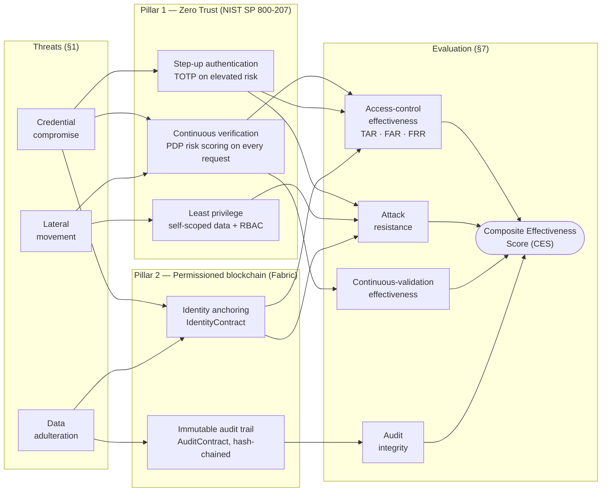
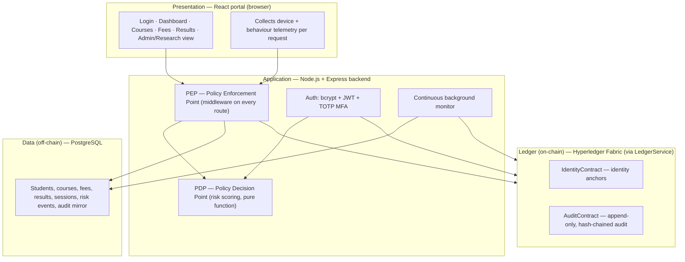
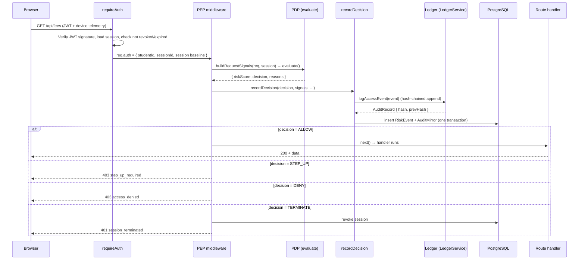
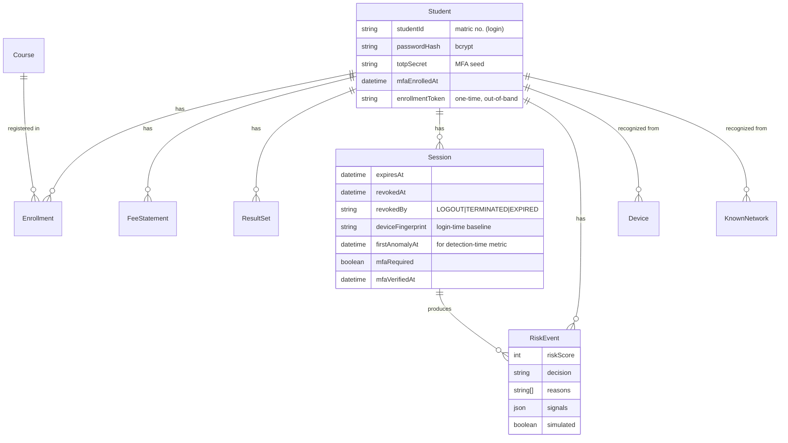
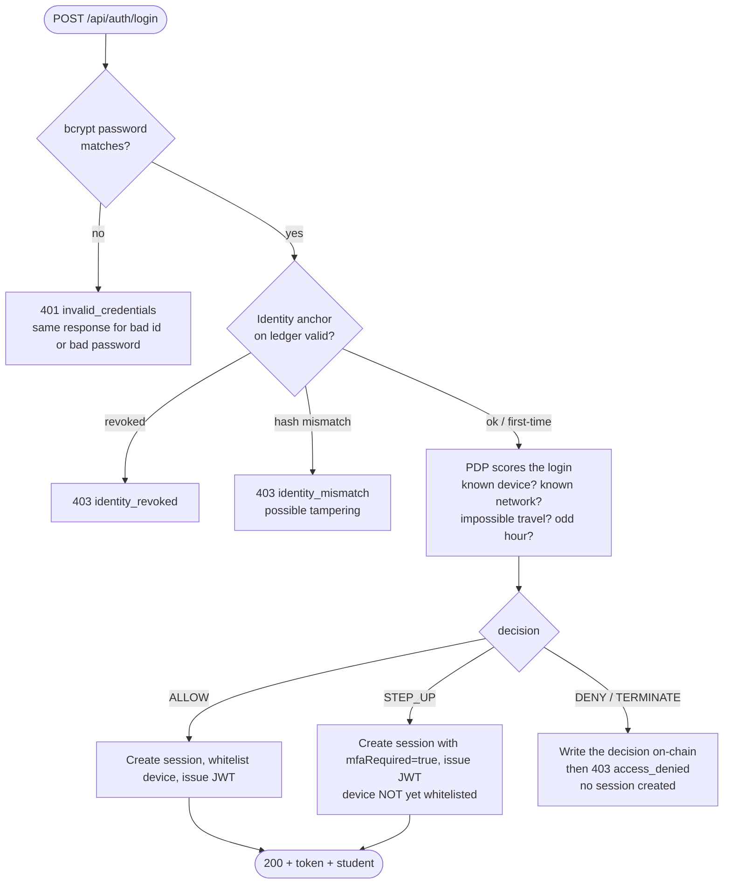
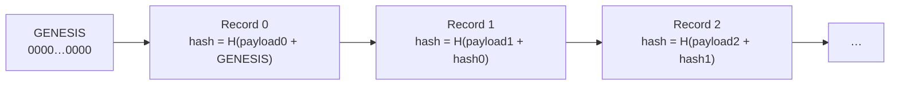
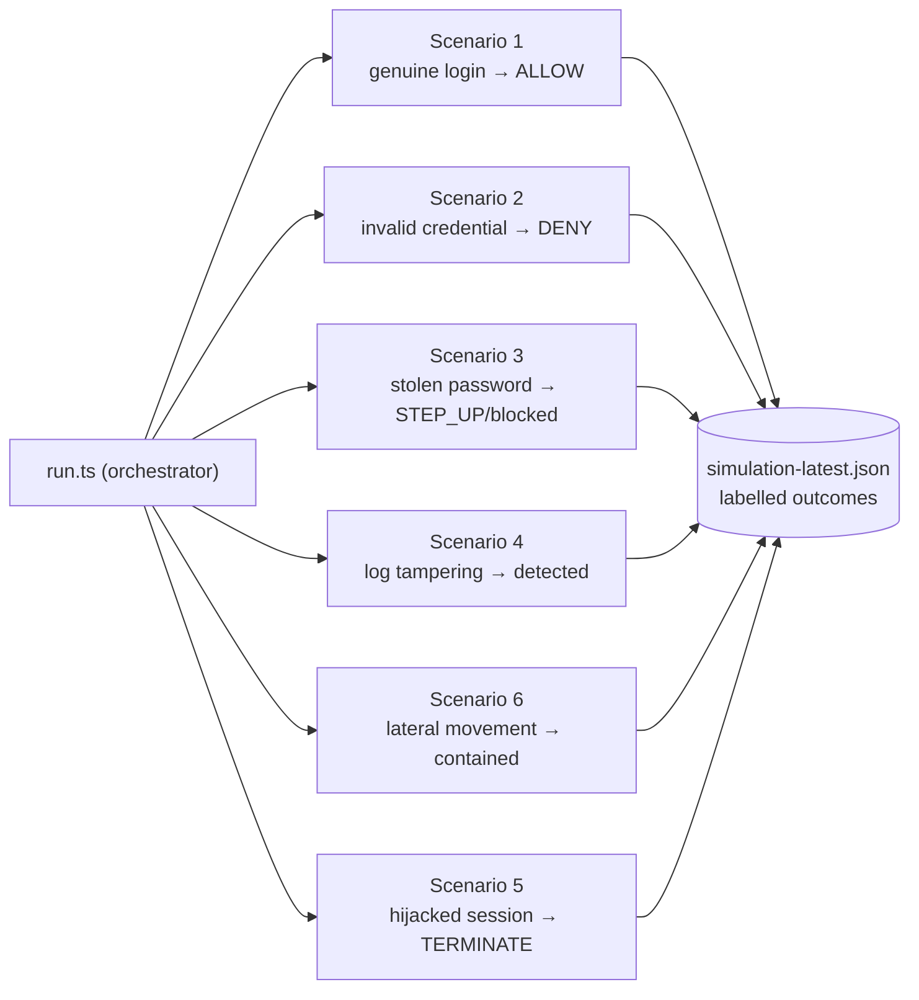
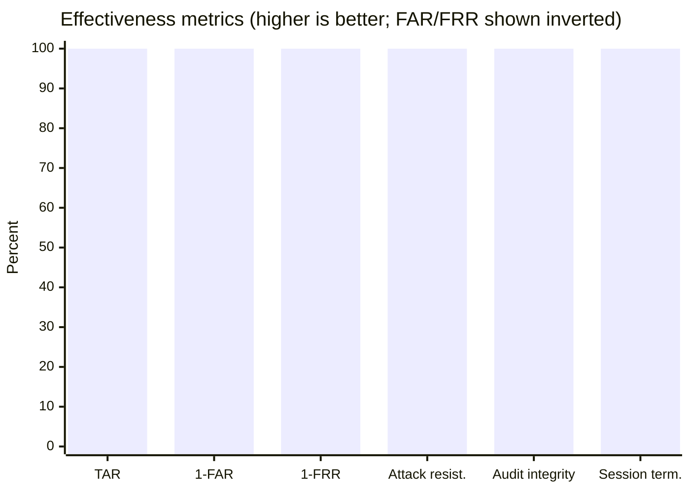
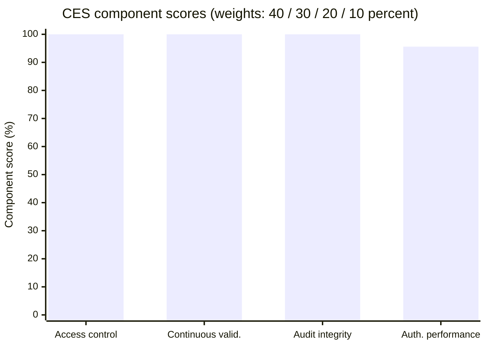

# Technical Report — Blockchain-Enhanced Identity Verification for Zero Trust Access Control

> A complete walkthrough of the system: what every part does, how the code is organized, and how
> a request flows end-to-end. Written to be read top-to-bottom — it starts high-level and drills
> into the code, with links to every source file.
>
> **Status: all nine roadmap phases complete, running on a live Hyperledger Fabric 2.5 network.**
> Every figure in [§9.1](#91-measured-results) was measured against that network on 20 July 2026 —
> 50 labelled trials across six attack scenarios — not estimated or carried over from an earlier
> run. One component of the composite score awaits a client decision, and is reported both with and
> without ([§13](#13-current-status--what-remains)).
>
> Diagrams use [Mermaid](https://mermaid.js.org/); they render on GitHub, in the VS Code Mermaid
> extension, and in Claude Artifacts. If you see raw ```mermaid blocks, install a Mermaid viewer.

**Contents**

1. [What the system is](#1-what-the-system-is)
   - 1.1 [Conceptual framework](#11-conceptual-framework)
2. [Architecture at a glance](#2-architecture-at-a-glance)
3. [Technology stack & repository layout](#3-technology-stack--repository-layout)
4. [The core idea: the Zero Trust request lifecycle](#4-the-core-idea-the-zero-trust-request-lifecycle)
5. [Data model (PostgreSQL)](#5-data-model-postgresql)
6. [Backend deep-dive](#6-backend-deep-dive)
   - 6.1 [Login & identity anchoring](#61-login--identity-anchoring)
   - 6.2 [The PDP — risk scoring](#62-the-pdp--risk-scoring)
   - 6.3 [The PEP — enforcement middleware](#63-the-pep--enforcement-middleware)
   - 6.4 [Step-up MFA (TOTP)](#64-step-up-mfa-totp)
   - 6.5 [The continuous background monitor](#65-the-continuous-background-monitor)
   - 6.6 [The ledger abstraction & hash chaining](#66-the-ledger-abstraction--hash-chaining)
   - 6.7 [The write path: recordDecision](#67-the-write-path-recorddecision)
   - 6.8 [Tamper detection](#68-tamper-detection)
7. [The chaincode (Phase 5)](#7-the-chaincode-phase-5)
8. [The attack simulation (Phase 8)](#8-the-attack-simulation-phase-8)
9. [The metrics & CES engine (Phase 9)](#9-the-metrics--ces-engine-phase-9)
   - 9.1 [Measured results](#91-measured-results)
   - 9.2 [Measured cost of immutability](#92-measured-cost-of-immutability)
10. [The frontend](#10-the-frontend)
11. [End-to-end traces](#11-end-to-end-traces) — happy path · stolen password · lateral movement
12. [How to run everything](#12-how-to-run-everything)
13. [Current status & what remains](#13-current-status--what-remains)

---

## 1. What the system is

A **university student portal** (login, course registration, fee statements, exam results) secured
by two ideas working together:

- **Zero Trust** — *never trust, always verify*. Every single request is re-evaluated for risk;
  a valid login token is never, by itself, enough. If a request looks risky mid-session, access is
  stepped-up, denied, or the session is killed outright.
- **Blockchain-anchored identity + audit** — each student's identity is *anchored* on a permissioned
  Hyperledger Fabric ledger, and every access decision is written to an **append-only, hash-chained**
  audit trail. Because the ledger cannot be rewritten, tampering with the records is always detectable.

The three security problems it targets (from the brief): **credential compromise** (stolen
passwords), **data adulteration** (tampering with stored records), and **lateral movement**
(a hijacked session roaming the system).

> **Ledger status.** The system runs on a **live Hyperledger Fabric 2.5 network** (`LEDGER=fabric`):
> two organisations, one channel, both contracts deployed and endorsed by both peers. Everything
> still sits behind the **`LedgerService` interface**, so the `MockLedger` implementation remains
> available (`LEDGER=mock`) for development without a blockchain — it is a stand-in for the
> interface, not the system of record. Everywhere below, "the ledger" means "whatever implements
> `LedgerService`". See [§13](#13-current-status--what-remains).

### 1.1 Conceptual framework

How the two ideas combine to produce the measured outcomes. Read left to right: the threats
determine which controls are needed, the controls are realised by the two architectural pillars,
and each pillar produces the evidence one metric group is computed from.



The claim the framework encodes: **neither pillar is sufficient alone.** Zero Trust decides
correctly but writes its decisions to storage an attacker with database access can rewrite; the
blockchain makes records permanent but decides nothing. Anchoring identity on-chain is what lets
the login gate detect a tampered credential hash, and hash-chaining the audit trail is what makes
the effectiveness numbers themselves trustworthy.

---

## 2. Architecture at a glance

Four layers, each with one job:



**The reading of it:** the browser sends a request (with device telemetry) → the PEP intercepts it →
asks the PDP for a risk decision → enforces that decision → writes the decision to the ledger and
mirrors it to PostgreSQL → returns the response. A background monitor independently re-scores live
sessions and can terminate one with no new request.

---

## 3. Technology stack & repository layout

| Layer | Technology |
|---|---|
| Blockchain | Hyperledger Fabric 2.5 (test-network) — *live: 2 orgs, 1 channel, both contracts deployed* |
| Smart contracts | Node.js chaincode (`fabric-contract-api`) |
| Backend | Node.js + Express + TypeScript |
| Database | PostgreSQL 16 (Prisma ORM) |
| Frontend | React + Vite + TypeScript + Tailwind |
| Auth | JWT + TOTP MFA (bcrypt password hashing) |

```
docker-compose.yml                PostgreSQL 16 container (published on 55432, not 5432)
scripts/
├── start.sh                      ONE-COMMAND STARTUP — the whole stack (Phase 9 packaging)
├── stop.sh                       Tear down; --purge also deletes the database volume
├── fabric-up.sh                  Fabric network + chaincode deploy + credential copy (Phase 4)
├── fabric-down.sh                Tear down the network and remove stale credentials
└── lib.sh                        Shared helpers (prerequisite checks, health waiting)
backend/
├── src/
│   ├── app.ts                    Express assembly: middleware, health, route mounting
│   ├── index.ts                  Server entry point (starts the continuous monitor)
│   ├── auth/                     Login, logout, MFA, JWT, requireAuth/requireAdmin guards
│   ├── zerotrust/                The Zero Trust engine: PDP, PEP, signals, geo, monitor, identity
│   ├── portal/                   Portal API: courses, enrollment, fees, results
│   ├── audit/                    Admin routes: audit trail, verify, metrics, identity revocation
│   ├── ledger/                   LedgerService interface + FabricLedger + MockLedger + hashEvent
│   ├── docs/openapi.ts           The OpenAPI document served at /docs and /openapi.json
│   ├── config/                   env + policy.config (weights, thresholds — the tuning knobs)
│   └── db/                       Prisma client
├── prisma/                       schema.prisma, migrations, seed.ts (30 students + 1 admin)
├── chaincode/                    Fabric smart contracts (Phase 5) — own package.json
├── simulation/                   The 6 attack scenarios (Phase 8)
├── evaluation/                   Metrics + CES engine (Phase 9)
├── tests/e2e.ts                  End-to-end HTTP test of the whole engine (37 checks)
├── tests/fabric-check.ts         Ledger acceptance checks against the live network (22 checks)
├── tsconfig.json                 Build config — scopes the compiler to src/
└── tsconfig.tools.json           Typecheck-only config for simulation/, evaluation/, tests/, prisma/
frontend/
└── src/                          React portal (pages, components, context, api client)
```

> `chaincode/`, `simulation/`, and `evaluation/` live under `backend/` at the client's request
> (the roadmap originally placed them at the repo root). `chaincode/` is **not** backend code — it
> runs on the Fabric peers and keeps its own `package.json`.

> **Why two tsconfigs.** `tsconfig.json` includes only `src/**`, because that is what `npm run
> build` compiles into `dist/`. The side effect was that four directories of real, shipped
> TypeScript — the simulation, the evaluation engine, the tests and the seed script — were checked
> by nothing at all: they run through `tsx`, which strips types without verifying them, so a type
> error there surfaced as a crash mid-run or not at all. `tsconfig.tools.json` closes that hole and
> `npm run typecheck` now runs both. It caught a broken reference the moment it was introduced.

---

## 4. The core idea: the Zero Trust request lifecycle

This is the single most important flow in the system. **Every authenticated request** to a
protected route goes through it.



The two halves — the **PDP** (decides) and the **PEP** (enforces) — are deliberately separated
(NIST SP 800-207 style). The PDP is a **pure function**: signals in, decision out, no side effects.
The PEP is where the I/O and enforcement live. This separation is what makes the risk logic testable
and the weights tunable in one config file.

---

## 5. Data model (PostgreSQL)

Defined in [prisma/schema.prisma](backend/prisma/schema.prisma). The tables fall into four groups.



**Group 1 — application data:** `Student`, `Course`, `Enrollment`, `FeeStatement`/`FeeItem`/`Payment`,
`ResultSet`/`ResultRecord`. Ordinary portal data.

**Group 2 — Zero Trust state:**
- `Session` — one login session. The JWT carries this row's id as its `jti`, so revoking the row kills
  the token instantly. Records the login-time device/IP/fingerprint *baseline* the PEP compares against.
- `RiskEvent` — one PDP decision for one request (the off-chain record of continuous verification).
  `simulated` flags harness-generated traffic so live metrics can exclude it.
- `Device` / `KnownNetwork` — devices and IPs a student has *previously* authenticated from. First
  login from a new one raises the `newDevice` / `newIpAddress` signal.

**Group 3 — the audit mirror:** `AuditMirror` — an off-chain copy of every on-chain audit record.
Deliberately has **no foreign keys**, so the tampering scenario can edit it in place and the integrity
verifier can catch the mismatch against the untamperable ledger copy.

**Group 4 — the ledger stand-in** (`LedgerIdentity`, `LedgerAuditRecord`): what `MockLedger` writes
to. **Unused under `LEDGER=fabric`** — real anchors and audit records live on the Fabric peers, and
these tables retain only whatever earlier mock runs left behind. They exist so the system can run
without a blockchain during development. Nothing outside `src/ledger/` touches them.

The seed ([prisma/seed.ts](backend/prisma/seed.ts)) creates **30 students** (1 hand-authored "hero" +
29 synthetic) plus **1 administrator**, with courses, fees, and results — meeting the Phase 8/9
population target.

> **Seeding is destructive, and on Fabric it is dangerous.** `seed.ts` regenerates every password
> hash, and an identity anchor is a commitment to that hash. It clears the mock ledger's anchor table
> to stay consistent — but on Fabric the anchors are **on-chain and cannot be deleted**, so re-seeding
> leaves every stored hash disagreeing with its anchor and every login refused with
> `identity_mismatch`: a permanent lockout that looks exactly like the tampering the system is
> designed to detect. `scripts/start.sh` therefore seeds only an empty database when `LEDGER=fabric`,
> and prompts before a forced re-seed.

---

## 6. Backend deep-dive

### 6.1 Login & identity anchoring

File: [src/auth/auth.routes.ts](backend/src/auth/auth.routes.ts). Login is **three gates**, in order:



1. **Password gate** — `bcrypt.compare`. A bad student id and a bad password return the **same** 401,
   in the same time (a dummy hash is compared when the id is unknown), so response timing never leaks
   which ids exist.
2. **Identity-anchor gate** — [src/zerotrust/identity.ts](backend/src/zerotrust/identity.ts). This is
   the blockchain half of login and it catches two things bcrypt *cannot*:
   - An identity **revoked** on the ledger (instant revocation even against a still-correct password).
   - A password hash **tampered with** in PostgreSQL: the anchor is a hash of the stored credential, so
     if an attacker rewrites the hash, the recomputed anchor no longer matches and login is refused —
     even though bcrypt would happily accept the planted password. *This is the "data adulteration"
     defence.* The anchor is `sha256(studentId + ":" + passwordHash)` (never the raw credential).
   - First-ever login **anchors** the student (enrollment); afterwards the anchor is checked, never
     silently rewritten.
3. **Risk gate** — the PDP scores the login from device, network, geovelocity and time signals. A new
   device forces `STEP_UP` (MFA) before any data is reachable; a physically impossible journey since
   the student's previous session can reach `TERMINATE` and refuse the login outright.

A subtle but load-bearing rule: a device/network is only marked "known" **after** a successful
step-up, never at password time. Otherwise anyone with the password could whitelist their machine by
attempting a login and walking away.

**Geovelocity at login compares against the previous *session*, not the `KnownNetwork` table.** That
choice matters: a network is only recorded once MFA has succeeded, so keying off it would miss exactly
the unverified logins the signal exists to catch. The previous session row is the honest record of
"where this student last authenticated from, and when", whether or not that attempt was trusted.

**A blocked login is written to the ledger before the 403 is returned.** ROADMAP §4.2 defines DENY as
"block this request *and* log it", and §2 step 4 writes every decision on-chain — a refused login is
the single most security-relevant event the system produces, so the audit trail must not be silent
about it. There is no session to attribute it to (the block happens before one is created), which is
why `RiskEvent.sessionId` is nullable. This branch was genuinely unreachable until geovelocity joined
the login signals: the earlier weights capped below the DENY threshold, so nothing had ever exercised
it, and the omission surfaced only when a real run produced a 403 with no corresponding audit record.

### 6.2 The PDP — risk scoring

Files: [src/zerotrust/pdp.ts](backend/src/zerotrust/pdp.ts) (the engine),
[src/zerotrust/signals.ts](backend/src/zerotrust/signals.ts) (signal extraction),
[src/config/policy.config.ts](backend/src/config/policy.config.ts) (the weights & thresholds).

The engine is trivial by design — it just sums the weights of the signals that fired and thresholds
the total:

```
riskScore = Σ (weight of every signal that fired), clamped 0–100
```

All seven ROADMAP §4.1 signals are implemented:

| Signal | Weight | §4.1 row | Meaning |
|---|---|---|---|
| `impossibleTravel` | **35** | IP / geovelocity | Reaching this location from the previous one would need > 900 km/h |
| `newDevice` | **30** | Device fingerprint | Current device fingerprint ≠ the one recorded for this context |
| `newIpAddress` | 20 | IP | Current IP ≠ the recorded one |
| `highRequestRate` | 20 | Behaviour (rate) | > 30 requests in a 10 s window |
| `abnormalNavigation` | 15 | Behaviour (navigation sequence) | > 8 *distinct* resources in a 60 s window |
| `staleSession` | 15 | Session age | Session past 85% of its lifetime |
| `oddHour` | 10 | Time of day | Outside business hours (06:00–22:00) |
| `sensitiveResource` | 10 | Resource sensitivity | Path is `/api/fees` or `/api/results` |

*Credential validity* — §4.1's remaining row — is deliberately **not** a weighted signal. It is a
hard pre-gate: bcrypt plus the on-chain anchor check must both pass before any risk score is
computed ([§6.1](#61-login--identity-anchoring)). A wrong password is not a risk factor to be
outweighed by favourable ones; it is a refusal.

| Risk score | Decision | Meaning |
|---|---|---|
| **< 30** | `ALLOW` | proceed |
| **30–59** | `STEP_UP` | require TOTP MFA |
| **60–84** | `DENY` | block this request |
| **≥ 85** | `TERMINATE` | revoke the session |

**Why `newDevice = 30` exactly** — this is the primary stolen-password signal, and 30 is precisely the
`STEP_UP` threshold. If it sat below 30, a thief who has the password *and* happens to be on a network
the student has used before (campus wifi, home, localhost in a demo) would be let straight through with
no MFA. The config file even has a startup assertion that throws if `newDevice` drops below the
threshold — *"this bug shipped once; the assertion is here so it cannot ship again."*

**Why `impossibleTravel = 35`** — the only signal weighted above `newDevice`, and the reasoning is
categorical rather than statistical. A new device is *unusual*; impossible travel is *physically
false* — the same person cannot be in London and Sydney four minutes apart, so one of the two
sessions is definitionally not the student. Alone it reaches `STEP_UP`; combined with `newDevice`
it reaches 65 → `DENY`, which is the right answer for a credential replayed from another
continent. A second startup assertion guards this weight the same way.

**Why `abnormalNavigation = 15`, below the `ALLOW` threshold** — deliberately the opposite choice.
Navigation breadth is a heuristic about how a person browses, and a genuine power user opening
several pages quickly can trip it, so it must never demand MFA unaided. It earns its keep by
compounding: with a sensitive resource (25) it still passes, but alongside a new device (45) or a
high request rate (35) it pushes an enumeration sweep into `STEP_UP`.

> **Geolocation is offline and table-driven** ([zerotrust/geo.ts](backend/src/zerotrust/geo.ts)).
> ROADMAP §8's ethics constraint is a self-contained prototype with no third-party systems, so
> locations resolve from a local table of the RFC 5737 documentation ranges the simulation drives.
> Any IP that cannot be located — localhost, private ranges — yields `impossibleTravel: false`
> rather than a guess: fabricating a location would manufacture impossible travel out of nothing
> and inflate the attack-resistance figure. Production swaps the table for MaxMind GeoLite2 behind
> the same `locate()` call.

Signals are built two ways ([signals.ts](backend/src/zerotrust/signals.ts)):
- `buildLoginSignals` — "has this student ever used this device/network before?" (checked against the
  persistent `Device`/`KnownNetwork` tables).
- `buildRequestSignals` — "does this request still match the device/network that authenticated this
  session?" (checked against the `Session` row's own login-time baseline). **This is the
  continuous-verification / mid-session-hijack check.**

### 6.3 The PEP — enforcement middleware

File: [src/zerotrust/pep.middleware.ts](backend/src/zerotrust/pep.middleware.ts). Mounted after
`requireAuth` on every protected route ([portal.routes.ts](backend/src/portal/portal.routes.ts) lines
27–28). It:

1. Builds the request's live signals and asks the PDP to `evaluate()` them.
2. Combines *this request's* risk with any **outstanding** requirement from earlier in the session
   (e.g. an unresolved STEP_UP from an unrecognized device at login) using `moreSevere()`. A fresh MFA
   verification (within `stepUpValidityMs` = 15 min) downgrades a STEP_UP back to ALLOW.
3. Writes the decision via `recordDecision`.
4. Enforces: `ALLOW` → `next()`; `STEP_UP` → 403 `step_up_required`; `DENY` → 403 `access_denied`;
   `TERMINATE` → revoke the session + 401 `session_terminated`.

### 6.4 Step-up MFA (TOTP)

Files: [src/auth/mfa.ts](backend/src/auth/mfa.ts), the `/step-up` and `/mfa/enroll` routes in
[auth.routes.ts](backend/src/auth/auth.routes.ts). Uses standard TOTP (`otplib`) — the same 6-digit
codes an authenticator app produces.

A crucial security detail is the **enrollment token**: to *bind* an authenticator to an account you
need a one-time token the registrar delivers **out of band** (in person / to a verified address),
*not* down the same channel as the password. Without this, whoever logs in first could bind their own
phone as the second factor — so a stolen password alone would defeat MFA on any not-yet-enrolled
account. The token is consumed on first use. This closes a real hole (see the e2e test's scenario 7b).

### 6.5 The continuous background monitor

File: [src/zerotrust/continuousMonitor.ts](backend/src/zerotrust/continuousMonitor.ts). The PEP only
runs *when a request arrives*. The monitor provides the **"no new user action"** half of continuous
verification: every 15 seconds it re-scores each active session's recent risk history and can terminate
one with no new request.


This is what catches a **hijacked session** (Scenario 5): an attacker replaying a stolen token from a
different machine trips `newDevice` on every request, the rolling score climbs, and the monitor kills
the session — measuring `firstAnomalyAt → revokedAt` as the **anomaly detection time**.

### 6.6 The ledger abstraction & hash chaining

Files: [src/ledger/LedgerService.ts](backend/src/ledger/LedgerService.ts) (the interface),
[src/ledger/MockLedger.ts](backend/src/ledger/MockLedger.ts) (current impl),
[src/ledger/FabricLedger.ts](backend/src/ledger/FabricLedger.ts) (stub for the real ledger),
[src/ledger/hashEvent.ts](backend/src/ledger/hashEvent.ts) (the hashing).

**The key design decision of the whole project:** the backend talks only to a single 8-method
`LedgerService` interface, never to Fabric directly. So swapping `MockLedger` for the real
`FabricLedger` changes *nothing* above the interface.

```
LedgerService (8 methods)
├── registerIdentity / verifyIdentity / revokeIdentity / getIdentity   (identity)
└── logAccessEvent / getAuditEvent / getAuditTrail / verifyEventIntegrity (audit)
```

`MockLedger` imitates the ledger's real guarantees rather than faking them:
- **Durable** — backed by PostgreSQL tables (survives restarts; an earlier in-memory version silently
  erased the whole trail on every restart).
- **Append-only** — there is no update/delete path for audit records anywhere in the class.
- **Hash-chained** — each record stores `SHA-256(payload + prevHash)`.

**The hash chain** — this is what makes tamper detection real:



Each record's hash depends on the previous record's hash, so **altering any record breaks its own hash
and every hash after it.** The exact formula (in [hashEvent.ts](backend/src/ledger/hashEvent.ts)) is:

```
hash = SHA-256( eventId | studentId | resource | decision | riskScore | timestamp | prevHash )
```

Concurrent appends are serialized by a Postgres transaction-scoped advisory lock, so two parallel
requests (a dashboard load fires four at once) can't both link to the same tail and fork the chain.

### 6.7 The write path: recordDecision

File: [src/zerotrust/recordDecision.ts](backend/src/zerotrust/recordDecision.ts). The single shared
write path used by both the PEP (real requests) and the monitor (background terminations). For one
decision it:

1. Builds an `AccessEvent` (`eventId` = random UUID, `timestamp` = now).
2. `ledger.logAccessEvent(event)` → appends to the hash-chained trail, returns the record with its hash.
3. In **one PostgreSQL transaction**, inserts a `RiskEvent` (for dashboards/monitor) **and** an
   `AuditMirror` row (the off-chain copy of the on-chain record).
4. Stamps `firstAnomalyAt` on the session the first time a non-ALLOW decision occurs (this is the
   start of the detection-time clock).

### 6.8 Tamper detection

File: [src/audit/audit.routes.ts](backend/src/audit/audit.routes.ts) →
`GET /api/admin/audit/verify/:eventId`. This is the defence against **data adulteration** of the log:


The trick: it recomputes the hash from the mirror's **current data**, not from the mirror's own stored
`hash` column (which an attacker could leave untouched while editing `riskScore`/`decision`).
Recomputing from live data is what actually catches an in-place edit. Because the ledger copy cannot be
altered, tampering is *always* caught — this is proven live in the e2e suite and by Scenario 4.

---

## 7. The chaincode (Phase 5)

Directory: [backend/chaincode/](backend/chaincode/). This is the **real blockchain code** — Node.js
smart contracts that run *on* the Fabric peers (not in the Express server, hence their own
`package.json`). Two contracts, mirroring the `LedgerService` interface exactly:

- [lib/identityContract.js](backend/chaincode/lib/identityContract.js) — `IdentityContract`:
  `registerIdentity`, `verifyIdentity`, `revokeIdentity`, `getIdentity`. Stores one anchor per student
  under composite key `('identity', studentId)`.
- [lib/auditContract.js](backend/chaincode/lib/auditContract.js) — `AuditContract`: `logAccessEvent`,
  `getAuditEvent`, `getAuditTrail`, `verifyEventIntegrity`. **Append-only** (a duplicate `eventId` is
  rejected) and **hash-chained** (via [lib/hashEvent.js](backend/chaincode/lib/hashEvent.js)).

**The load-bearing invariant:** the chaincode's `hashEvent.js` is kept **byte-for-byte identical** to
the backend's `hashEvent.ts`. The chaincode writes the on-chain hash; the backend's verifier recomputes
it from the off-chain mirror. If the two ever formatted a hash differently, every integrity check would
silently break. This parity is cross-checked in development.

**World-state layout** (how data is keyed on-chain):

```
IdentityContract:  ('identity', studentId)               → IdentityAnchor JSON
AuditContract:     ('audit', <padSeq>)                   → AuditRecord JSON (chain order)
                   ('auditEvent', eventId)               → padSeq          (O(1) lookup by id)
                   ('auditStudent', studentId, <padSeq>) → padSeq          (per-student scan)
                   'audit:seq' → next sequence   'audit:head' → chain-tip hash
```

**Determinism** matters for a blockchain: every peer must compute the identical result to reach
consensus. So the contracts use no clocks or randomness — the `eventId` and `timestamp` are supplied
by the backend, and identity `registeredAt` uses the deterministic transaction timestamp.

**Offline tests** ([test/contracts.test.js](backend/chaincode/test/contracts.test.js)) — 26 checks
against an in-memory stub, run with `npm test` in the chaincode dir. They validate: identity
register/verify/revoke/re-anchor semantics; audit sequencing + chain linkage; append-only rejection of
duplicate ids; per-student and full trails; input validation; and tamper detection.

> **Deployed and endorsed by both peers.** `FabricLedger` wraps these contracts and nothing above
> `LedgerService` changes — the same engine, simulation and metrics run unmodified on either
> implementation. Beyond the 26 offline checks, `npm run test:fabric` runs 22 acceptance checks
> against the live network (identity semantics, hash-chain ordering, concurrent-write safety,
> tamper detection), and records have been read back directly from a peer, bypassing the
> application entirely, to confirm they are genuinely on-chain.

---

## 8. The attack simulation (Phase 8)

Directory: [backend/simulation/](backend/simulation/). Run with `npm run sim`. This is the **evaluation
harness** — it stages realistic attacks against the *real running backend over HTTP* and records
**labelled outcomes** (ground truth + what the engine actually decided) so the metrics can be computed
honestly.



| # | Scenario file | Story | Expected | Feeds |
|---|---|---|---|---|
| 1 | [s1-genuine-login.ts](backend/simulation/scenarios/s1-genuine-login.ts) | Real student, known device | ALLOW, reaches data | TAR, FRR |
| 2 | [s2-invalid-credential.ts](backend/simulation/scenarios/s2-invalid-credential.ts) | Wrong password / unknown id | DENY at auth | FAR, attack resistance |
| 3 | [s3-credential-theft.ts](backend/simulation/scenarios/s3-credential-theft.ts) | Correct password, unknown device | STEP_UP, blocked | FAR, attack resistance |
| 4 | [s4-log-tampering.ts](backend/simulation/scenarios/s4-log-tampering.ts) | Edit the audit mirror | Verifier flags mismatch | Audit integrity |
| 5 | [s5-abnormal-behaviour.ts](backend/simulation/scenarios/s5-abnormal-behaviour.ts) | Replay token from another machine | Mid-session TERMINATE | Continuous validation |
| **6** | [s6-lateral-movement.ts](backend/simulation/scenarios/s6-lateral-movement.ts) | **Legitimate session tries to spread** | **Contained on every axis** | **FAR, attack resistance** |

Execution order is 1 → 2 → 3 → 4 → 6 → 5, and it is not arbitrary: 1–3 run first so there is real
hash-chained history for 4 to tamper with, and 5 runs last because it waits on real background-monitor
ticks rather than simulating them.

### Why Scenario 6 exists

The five scenarios above come straight from the roadmap's Phase 8 table. Scenario 6 does not — it was
added because ROADMAP §1 names **three** security challenges and only two were ever exercised.
Credential compromise is covered by 2 and 3; data adulteration by 4; **lateral movement had no test at
all**, yet the brief claims the model "re-verifies every request, so a foothold in one area cannot
silently spread". That claim was unsupported by evidence.

Scenarios 2 and 3 model an attacker trying to **get in**. Scenario 6 assumes they already **are** in —
it starts from the strongest possible foothold, a fully legitimate, MFA-enrolled student session on a
recognised device — and measures whether that foothold can be widened. Three axes, all labelled
`attack`:

| Axis | Probes | Contained by |
|---|---|---|
| **Horizontal** | Read another student's fees/results/profile by injecting their id | Every query is scoped to the token's own `studentId` — the injected parameter is simply ignored |
| **Vertical** | Reach the audit trail, research metrics, integrity verifier, and the on-chain revocation endpoint | `requireAdmin` — STUDENT and ADMIN are disjoint roles |
| **Discovery** | Sweep 12 undocumented endpoints | Nothing to find; the sweep raises `abnormalNavigation` |

An important distinction for the evaluation: containment here is **not** the risk engine blocking a
suspicious request. It is the authorization model giving the attacker nothing to reach. Both are Zero
Trust; only one of them is a risk score. `granted` is judged on whether the probe actually yielded
data — for the horizontal probes, that means data *different from the attacker's own*, since an
endpoint that ignores the injected id and returns the caller's own record has contained the attempt.

Scenario 6 also carries the **only geovelocity test in the suite**. Every other request in the harness
originates on localhost, which `geo.ts` deliberately refuses to place — so without an explicit client
IP the `impossibleTravel` signal could never fire in an evaluation, leaving it implemented but
unmeasured. The scenario authenticates a victim from a London address and replays the same credential
from Sydney seconds later; ~17,000 km in that gap is not survivable by any person, and the engine
blocks it at risk 85 (`newDevice` + `newIpAddress` + `impossibleTravel` → TERMINATE).

Both detection claims are verified against the engine's **own recorded reasons** in the database, not
inferred from a status code — other signals would also have blocked these requests, and inferring from
the outcome would not prove the new signals work.

### Shared machinery

[harness.ts](backend/simulation/harness.ts) holds the HTTP client, the simulated devices, MFA helpers,
and account reset/preparation; labelled-outcome types live in [types.ts](backend/simulation/types.ts).
Each trial is tagged `legitimate` or `attack` alongside whether the actor *actually reached data* —
which is exactly the confusion matrix (see §9). Runs use dedicated synthetic students (never the hero
account) and reset them first, so results are deterministic and re-runnable.

---

## 9. The metrics & CES engine (Phase 9)

Directory: [backend/evaluation/](backend/evaluation/). Run with `npm run evaluate`. It reads the Phase 8
labelled report and computes every metric group + the **Composite Effectiveness Score**, exporting JSON,
CSV, and a self-contained HTML chart.

Files: [metrics.ts](backend/evaluation/metrics.ts) (pure math),
[report.ts](backend/evaluation/report.ts) (assembles + serializes to CSV/HTML),
[run.ts](backend/evaluation/run.ts) (reads the report, prints a summary, writes files).

**The confusion matrix** — every labelled trial lands in one box:

|  | Actor got in (granted) | Actor blocked |
|---|---|---|
| **Legitimate user** | TP (true positive) | FN (false negative) |
| **Attacker** | FP (false positive) | TN (true negative) |

**The metrics** (ROADMAP §7):

- **TAR** = TP / (TP + FN) — legit users correctly let in (want high)
- **FRR** = FN / (TP + FN) = 1 − TAR — legit users wrongly blocked (want low)
- **FAR** = FP / (FP + TN) — attackers wrongly let in (want low)
- **Attack resistance** = blocked attacks / total attacks × 100
- **Continuous validation** = session termination rate %, mean anomaly detection time (seconds)
- **Audit integrity** = detected tampering / total tampering × 100

**The CES** combines them into one grade:

```
CES = 0.4·AccessControl + 0.3·ContinuousValidation + 0.2·AuditIntegrity + 0.1·AuthPerformance
```

Because the roadmap gives TAR/FAR/FRR separately, the engine rolls "Access Control" into a single 0–1
number as **balanced accuracy = (TAR + (1 − FAR)) / 2**. Any component with no data is dropped and the
remaining weights renormalized, so a missing scenario lowers confidence rather than silently scoring 0.

> **Open item — "Authentication Performance."** ROADMAP §7 Table 1 assigns this 10% but never defines
> it alongside the other three. The engine scores it against **published HCI response-time
> thresholds** rather than an invented budget: full marks at or under **3 s** (the common web-response
> threshold), zero at or over **10 s** (Nielsen's *limit of attention*), linear between. Both anchors
> come from the literature, not from the measured result — the system meets the target under any
> definition at or above its measured latency. The CES is still reported **both including and
> excluding** the component until the client confirms it.

### 9.1 Measured results

All six scenarios, run against the **live Hyperledger Fabric network** (`LEDGER=fabric`, 2 orgs,
both contracts endorsing). **Sample sizes accompany every rate**, as ROADMAP §8 requires — a rate
without its denominator is not a result.

| Metric | Result | Basis |
|---|---|---|
| True Acceptance Rate (TAR) | **1.00** | 12 legitimate trials |
| False Acceptance Rate (FAR) | **0.00** | 36 attack trials |
| False Rejection Rate (FRR) | **0.00** | 12 legitimate trials |
| Confusion matrix | **TP 12 · FN 0 · FP 0 · TN 36** | 48 access-control trials (scenarios 1, 2, 3, 6) |
| Attack resistance | **100%** | 36 / 36 blocked |
| Audit integrity | **100%** | 6 / 6 tampering attempts detected |
| Session termination rate | **100%** | 2 risky sessions |
| Mean anomaly detection time | **7.19 s** | 2 terminated sessions |
| Mean login latency | **3 310 ms** | on-chain identity-anchor check included |
| Mean MFA verification | **47 ms** | off-chain, reported but not folded into the score |
| Authentication Performance | **0.956** | 3 310 ms against a 3 000 ms target / 10 000 ms ceiling |
| **CES** *(excl. Authentication Performance)* | **100 / 100** | weights renormalized over 3 defined components |
| **CES** *(incl. provisional Authentication Performance)* | **99.6 / 100** | full 40/30/20/10 weighting |

Both new risk signals were confirmed firing by the engine's own records, not inferred from
outcomes: `impossibleTravel` blocked a London→Sydney credential replay at risk score 85
(`newDevice` + `newIpAddress` + `impossibleTravel` → TERMINATE), and `abnormalNavigation` was
raised by a 12-endpoint discovery sweep. Total run: 50 labelled trials, **zero surprises**.

> **The one number that is not perfect is the honest one.** Measured login latency on the
> blockchain is **3 310 ms — slightly over the 3 000 ms target**, so Authentication Performance
> scores 0.956 rather than 1.0 and the full-weighting CES is 99.6, not 100.
>
> That threshold was chosen from the HCI literature *before* this run and has deliberately not
> been adjusted afterwards. Moving it to 3 500 ms would produce a perfect score and would be
> exactly the fitted-to-result reasoning this report should not engage in. The finding stands as
> measured: a synchronous on-chain identity check at login costs more than the 3-second web
> response threshold allows, which is precisely the trade-off [§9.2](#92-measured-cost-of-immutability)
> quantifies. **This is the number the client's definition should be set against.**





Three caveats an examiner will reasonably raise, stated here rather than left to be found:

- **Detection time is 7.19 s, not the 1.4 s** of ROADMAP §7's illustrative table. That is a direct
  consequence of the continuous monitor's 15 s tick (`continuousMonitorIntervalMs`): mean detection
  cannot fall below roughly half the polling interval. It is a tuning constant, not a limit of the
  approach — the trade-off is monitor load against detection latency.
- **The sample is small** (50 labelled access trials). Perfect scores over tens of trials demonstrate that the mechanisms work as designed;
  they are not a claim about behaviour at university scale, which ROADMAP §8 already places out of
  scope.
- **Perfect scores invite the question of whether the test is too easy.** The honest answer is that
  the scenarios are adversarial by construction — Scenario 3 gives the attacker the *correct*
  password, Scenario 6 starts them inside a fully legitimate MFA-enrolled session — and that the
  simulation is what surfaced four real defects before this run. A 100% that survives those
  conditions is a statement about the mechanisms, not about the difficulty of the test.

The charts and the underlying numbers are regenerated by `npm run evaluate`, which writes
`metrics-latest.{json,csv,html}` to [backend/evaluation/results/](backend/evaluation/results/); the
HTML file is a self-contained interactive dashboard of the same data.

### 9.2 Measured cost of immutability

Going live on Fabric produced two numbers a simulated ledger could not:

| | Off-chain (MockLedger) | On-chain (Fabric) |
|---|---|---|
| Access decision | ~0.05 s | **~2.1 s** |
| Login (incl. anchor check) | 0.30 s | **3.31 s** |
| Storage per decision | 354 B | **~8 KB on every peer, permanently** |

Both login figures are measured means over the same 6-scenario run executed against each ledger —
an **11× increase** attributable entirely to moving the identity anchor check and the decision
write on-chain.

The latency is endorsement by both organisations plus ordering and commit; the storage is the
transaction envelope, endorsement signatures and certificates that make a record *provable* — the
audit record itself is only 354 bytes of it. Appends are serialised to preserve the hash chain, so
concurrent requests queue.

**Interpretation.** Immutability is not free; it is paid for in latency and storage. The current
design suits high-value security events. For routine access at full university scale, periodic
**Merkle-root anchoring** — batching decisions off-chain and committing only the root — would
preserve tamper detection at a fraction of the cost. That is the recommended next architectural
step, and is out of scope for this prototype.

---

## 10. The frontend

Directory: [frontend/src/](frontend/src/). React + Vite + TypeScript + Tailwind. Key pieces:

- **API client** [lib/api.ts](frontend/src/lib/api.ts) and **telemetry**
  [lib/telemetry.ts](frontend/src/lib/telemetry.ts) — the browser collects a small real client
  signature (locale, timezone, screen size, hardware concurrency) and sends it as `X-Device-Telemetry`
  on every request; the server folds it into the device fingerprint.
- **Auth context** [context/AuthContext.tsx](frontend/src/context/AuthContext.tsx) and **step-up**
  [context/StepUpContext.tsx](frontend/src/context/StepUpContext.tsx) — MFA is built into the sign-in
  flow (password, then a TOTP code only if the engine flags the device/network), and a step-up dialog
  ([components/StepUpDialog.tsx](frontend/src/components/StepUpDialog.tsx)) can appear when a
  mid-session request returns `step_up_required`.
- **Pages** [pages/](frontend/src/pages/) — Login, Dashboard, Course Registration, Fee Statement,
  Results, and the **Admin/Research view** ([pages/Admin.tsx](frontend/src/pages/Admin.tsx)): the
  audit-trail viewer, a per-record **Verify Integrity** button, and live engine metrics.
- **Role separation** — [components/AdminRoute.tsx](frontend/src/components/AdminRoute.tsx) and
  `StudentRoute` gate the two areas on `student.role`, with a role-aware landing redirect. The UI
  guard is convenience; the real boundary is `requireAdmin` on the server, so a client that ignores
  the role field still receives a 403.

**The trust/risk widget polls.** ROADMAP Phase 7 asks for a *live* widget, and a value captured at
login is not one: the background monitor re-scores sessions every 15 seconds, so a static number can
sit on screen contradicting the engine right up until the session is terminated — hiding the single
behaviour the whole prototype exists to demonstrate. `AuthContext` re-reads the student every 15
seconds to match the monitor's tick, suspending while the tab is hidden and refreshing immediately on
return. It polls `/api/auth/me` deliberately: that route sits behind `requireAuth` only, **not** the
PEP, so the widget cannot feed its own request rate back into the `highRequestRate` signal or add
resources to the navigation-breadth window. A widget that raised the risk it displays would be worse
than no widget.

**A terminated session says so.** The backend distinguishes an engine termination
(`401 session_terminated`) from an ordinary expiry, and the client preserves that distinction through
to the login screen, which explains what happened. Collapsing the two — which is what happens if you
only inspect the status code — makes a Zero Trust kill indistinguishable from an idle timeout: the
student is silently bounced to a blank form with no indication the engine acted.

The Admin view deliberately shows **only** the metrics that can be computed honestly from live traffic
(decision counts, session termination rate, mean detection time). It does **not** show TAR/FAR/FRR/CES,
because those require the *labelled* attack-vs-legitimate traffic that only the Phase 8 simulation
produces — you cannot compute them from unlabelled real users.

Two identity operations are exposed through the API rather than the UI (both admin-only, both
documented at `/docs`):

- `GET /api/admin/identity/{studentId}/verify` — the identity counterpart of the audit verifier.
  Recomputes the credential hash from PostgreSQL and submits it to `IdentityContract.verifyIdentity`,
  so **the comparison happens inside the chaincode**, not in this server. `validOnChain: false` with
  `revoked: false` means the stored password hash no longer matches its anchor — the database was
  tampered with. This is the production call site of the roadmap's `verifyIdentity`; login uses the
  richer `getIdentity` path instead, for the reason given in [§6.1](#61-login--identity-anchoring).
- `POST /api/admin/identity/{studentId}/revoke` — irreversible, so deliberately not a button. A
  one-click control for a permanent action in a demo interface is a hazard, not a feature.

---

## 11. End-to-end traces

Two concrete walkthroughs to tie it all together.

### Trace A — a genuine student reads their fees (happy path)

1. Browser: `POST /api/auth/login` with `SU/CS/2023/0187` / `demo1234` + device telemetry.
2. `bcrypt.compare` passes → identity-anchor check passes (or anchors on first login) → PDP scores the
   login. Known device + known network → score < 30 → `ALLOW`. A `Session` is created, the device is
   whitelisted, a JWT (`jti` = session id) is returned.
3. Browser: `GET /api/fees` with the JWT.
4. `requireAuth` verifies the JWT and loads the session. The PEP builds request signals: device matches
   the session baseline, `sensitiveResource` fires (+10) → score 10 < 30 → `ALLOW`.
5. `recordDecision` appends an ALLOW event to the hash-chained ledger and mirrors it to Postgres.
6. The handler returns the fee statement → **200**.

### Trace B — an attacker with a stolen password (Scenario 3)

1. Attacker: `POST /api/auth/login` with the correct password but from an **unknown machine**.
2. Password gate passes; identity anchor passes. PDP: `newDevice` fires (+30) → score 30 → `STEP_UP`.
   A session is created with `mfaRequired = true`; the device is **not** whitelisted. A JWT is returned.
3. Attacker: `GET /api/fees` with the JWT. The PEP sees the session's outstanding STEP_UP is unsatisfied
   (`mfaVerifiedAt` is null) → `403 step_up_required`. **Data is unreachable.**
4. Attacker tries `POST /api/auth/step-up` with a guessed code → TOTP check fails → `400`. They have no
   authenticator and cannot enroll one (no out-of-band enrollment token).
5. Every one of these attempts is written to the ledger as a labelled event. The attacker never reaches
   data → in the metrics this is a **TN** (attacker correctly blocked) and counts toward 100% attack
   resistance.

### Trace C — a legitimate student tries to spread (Scenario 6)

The case the risk engine does **not** handle, and does not need to.

1. A real, MFA-enrolled student signs in from their own recognised device. Every signal is clean:
   score 0 → `ALLOW`. Nothing about this session is suspicious, and nothing should be.
2. They request `GET /api/fees?studentId=<another student>`. The PEP scores it — `sensitiveResource`
   fires (+10) → score 10 → `ALLOW`. **The request is permitted**, and the handler runs.
3. The handler queries `getFeeStatement(req.auth!.studentId)` — the id from the *token*, never the
   query string. The response is the caller's own statement, byte-identical to what `/api/fees` would
   have returned. The injected parameter had no effect because nothing ever reads it.
4. They try `GET /api/admin/audit`. `requireAdmin` reads the role from PostgreSQL (not from the token,
   so a revoked admin loses access immediately) → `403 forbidden`.
5. They sweep 12 undocumented paths. All 404. Distinct-resource count crosses 8 in the window →
   `abnormalNavigation` fires, and the risk score begins climbing on subsequent requests.

The lesson for the evaluation: **containment came from authorization, not from risk scoring.** Step 2
was correctly allowed — treating a legitimate student's own dashboard traffic as suspicious would
generate false rejections and damage TAR for no security benefit. The attempt failed because there was
nothing to reach: no endpoint accepts another student's id, and the admin surface is a different role
entirely. Risk scoring is the second line, and it does its job in step 5 by making a *pattern* of
probing visible even when each individual request is innocuous.

---

## 12. How to run everything

**Prerequisites:** Docker and Node 20+. Nothing else — PostgreSQL is containerised, and the
scripts install dependencies, generate `.env`, migrate and seed on first run.

### One command

```bash
./scripts/start.sh              # MockLedger or whatever backend/.env says
./scripts/start.sh --fabric     # also starts the Fabric network + deploys the chaincode
./scripts/start.sh --fabric --keep   # reuse a network that is already running
```

That replaces the eight manual steps this previously took (start Postgres → migrate → seed →
`network.sh up` → `deployCC` → copy three certificates → start backend → start frontend). It
brings up:

| | |
|---|---|
| Portal | http://localhost:5173 |
| API + Swagger UI | http://localhost:3000 · http://localhost:3000/docs |
| PostgreSQL | localhost:**55432** (containerised) |

Sign in as `SU/CS/2023/0187` / `demo1234`, or `SU/IT/ADMIN/001` / `demo1234` for the Admin view.
Ctrl-C stops the backend and frontend; `./scripts/stop.sh` stops PostgreSQL.

> **Why port 55432 and not 5432?** Machines that have run this project usually have a local
> PostgreSQL on 5432. Docker will publish onto the same port on Windows rather than refusing to
> bind, and the host then resolves `localhost:5432` to whichever bound first — so the stack quietly
> connects to the wrong database. Publishing somewhere unlikely to be occupied keeps the packaged
> stack self-contained. If `backend/.env` already points elsewhere, `start.sh` says so instead of
> starting a container nobody uses.

### The rest

```bash
# ── evaluation pipeline (stack must be running) ──────────────────────
cd backend
npm run sim                   # Phase 8: 6 scenarios → simulation/results/*.json
npm run evaluate              # Phase 9: metrics + CES → evaluation/results/*.{json,csv,html}
#   open backend/evaluation/results/metrics-latest.html for the dashboard

# ── verification ─────────────────────────────────────────────────────
npm run test:e2e              # drives the running backend over HTTP
npm run test:fabric           # ledger acceptance checks — STOP THE BACKEND FIRST (see below)
npm run typecheck             # src/ AND simulation/evaluation/tests/prisma
cd chaincode && npm install && npm test    # 26 offline chaincode checks

# ── teardown ─────────────────────────────────────────────────────────
./scripts/stop.sh             # stop PostgreSQL (data preserved)
./scripts/stop.sh --purge     # ...and delete the volume
./scripts/stop.sh --fabric    # ...and tear down the Fabric network
```

> **`npm run test:fabric` needs the backend stopped.** It writes to the ledger directly, so a
> running backend appends to the same chain from another process. Both contend for the single
> `audit:head` key and one fails at commit with `MVCC_READ_CONFLICT` — the in-process append queue
> cannot serialise across processes. That is inherent to a hash-chained log (one global tail is one
> global serialisation point), not a defect, and it is the same pressure that motivates the
> Merkle-root batching in [§9.2](#92-measured-cost-of-immutability). With the backend stopped the
> suite passes 22/22. The other suites are unaffected: `test:e2e` and `npm run sim` drive the
> backend over HTTP, so all their chain writes go through the one process that holds the queue.

> **Re-seeding on Fabric is destructive and `start.sh` will not do it silently.** `prisma/seed.ts`
> regenerates every password hash, and an identity anchor is a commitment to that hash. It clears
> the MockLedger's anchor table to stay consistent, but on Fabric the anchors are on-chain and
> cannot be deleted — so re-seeding leaves every stored hash disagreeing with its anchor and every
> login refused with `identity_mismatch`. On Fabric the script seeds only an empty database, and
> `--seed` prompts first.

---

## 13. Current status & what remains

| Phase | Status |
|---|---|
| 1 — Environment setup | ✅ Done (WSL2 + Docker + Fabric 2.5 toolchain) |
| 2 — Scaffold + LedgerService | ✅ Done |
| 3 — PostgreSQL + seed | ✅ Done — 30 students + 1 administrator |
| 4 — Fabric network | ✅ Done — 2 orgs, 1 channel, CA identities, one-command start script |
| 5 — Chaincode | ✅ Done — both contracts deployed and endorsed by both peers |
| 6 — Backend + Zero Trust engine | ✅ Done — all 7 §4.1 signals implemented |
| 7 — React portal | ✅ Done — incl. live trust widget and STUDENT/ADMIN split |
| 8 — Attack scenarios | ✅ Done — 6 scenarios (the 5 required, plus lateral movement) |
| 9 — Metrics + CES | ✅ Done — metrics, charts, and one-command packaging |

**The build is complete.** Every phase of the approved roadmap is implemented and running against
the live Fabric network. What follows is the honest list of what is *not* claimed.

**One open decision, which needs the client:**

- **"Authentication Performance"** (ROADMAP §7, 10% weight) is defined in Table 1 but never given a
  formula. It is currently scored against published HCI thresholds (3 s target / 10 s ceiling, see
  [§9](#9-the-metrics--ces-engine-phase-9)) and flagged `provisional` in every export. Measured
  login latency on the blockchain is **3.31 s**, which slightly exceeds that target — scoring
  0.956 and putting the full-weighting CES at 99.6. **Confirming an acceptable login time is the
  last thing standing between the report and an unasterisked CES.**

**Deliberate prototype limitations** (all within ROADMAP §8's declared scope):

- **Geolocation is table-driven, not a live GeoIP service.** `zerotrust/geo.ts` resolves the RFC
  5737 documentation ranges the simulation uses; production would substitute MaxMind GeoLite2
  behind the same `locate()` function. §8's ethics constraint rules out third-party lookups here,
  and a fixed table keeps every evaluation run reproducible.
- **Behaviour modelling is rate + navigation breadth**, not behavioural biometrics. §8 already
  names ML/biometric scoring as future work.
- **Two organisations on one host.** A functional research deployment, not a production topology.
- **Identity revocation is permanent.** `IdentityContract` has no un-revoke transaction by design,
  so `POST /api/admin/identity/:id/revoke` is an explicit administrative act and is deliberately
  *not* wired to the risk engine's TERMINATE decision — a false-positive score must never be able
  to lock a student out of their records irreversibly.

**Recommended next architectural step** (out of scope, evidenced in
[§9.2](#92-measured-cost-of-immutability)): periodic **Merkle-root anchoring** to reduce the ~2.1 s
and ~8 KB per-decision cost of writing every event on-chain.

---

*Generated as a technical companion to [README.md](README.md), [ROADMAP.md](ROADMAP.md) (the
authoritative build plan), and [REQUIREMENTS.md](REQUIREMENTS.md) (the original brief).*
